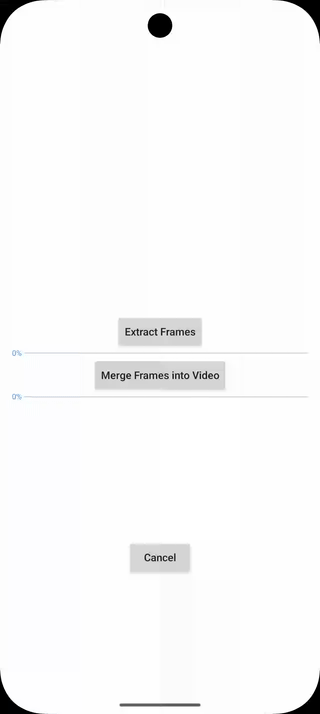

# Android Mediacodec Transcoder

[](https://central.sonatype.com/artifact/net.kibotu/android-mediacodec-transcoder) [](https://jitpack.io/#kibotu/android-mediacodec-transcoder) [](https://github.com/kibotu/android-mediacodec-transcoder/actions/workflows/android.yml) [](https://android-arsenal.com/api?level=21) [](https://android-arsenal.com/api?level=35) [](https://www.oracle.com/java/technologies/javase/17all-relnotes.html) [](https://docs.gradle.org/current/release-notes) [](https://kotlinlang.org/)

Surprisingly fast on device video transcoding.

Features

- extracting images from video mediacodec
- creating video from image mediacodec

[](docs/screen-recording.gif)

# How to install

## MavenCentral

```groovy 
allprojects {
    repositories {
        mavenCentral()
    }
}

dependencies {
    implementation 'net.kibotu:android-mediacodec-transcoder:{latest-version}'
}

```

## Jitpack

```groovy
allprojects {
    repositories {
        ...
        maven { url 'https://jitpack.io' }
    }
}

dependencies {
    implementation 'com.github.kibotu:android-mediacodec-transcoder:{latest-version}'
}
```

# How to use MediaCodec Part

### Extracting frames

```kotlin
 MediaCodecTranscoder.extractFramesFromVideo(
	context = this,
	frameTimes = times,
	inputVideo = inputVideo,
	id = "loremipsum",
	outputDir = frameFolder,
	photoQuality = 100
    )
	.subscribeOn(Schedulers.io())
	.observeOn(AndroidSchedulers.mainThread())
	.subscribe(
	    { logv { "extractFramesFromVideo progress $it" }},
	    { logv { "extracting frames failed ${it.message}" }}, 
	    { logv { "extracting frames successfully completed" }}
	).addTo(subscription)
```

### Merging frames to create video

```kotlin
MediaCodecTranscoder.createVideoFromFrames(
	frameFolder = frameFolder,
	outputUri = outputVideo,
	deleteFramesOnComplete = true
    )
	.subscribeOn(Schedulers.io())
	.observeOn(AndroidSchedulers.mainThread())
	.subscribe(
	    {logv { "createVideoFromFrames progress $it" }},
		{ logv { "merging frames to create a video failed ${it.message}" }}, 
		{ logv { "video creation successfully completed" } }
	).addTo(subscription)
```


### License

<pre>
Copyright 2024 Jan Rabe

Licensed under the Apache License, Version 2.0 (the "License");
you may not use this file except in compliance with the License.
You may obtain a copy of the License at

http://www.apache.org/licenses/LICENSE-2.0

Unless required by applicable law or agreed to in writing, software
distributed under the License is distributed on an "AS IS" BASIS,
WITHOUT WARRANTIES OR CONDITIONS OF ANY KIND, either express or implied.
See the License for the specific language governing permissions and
limitations under the License.
</pre>